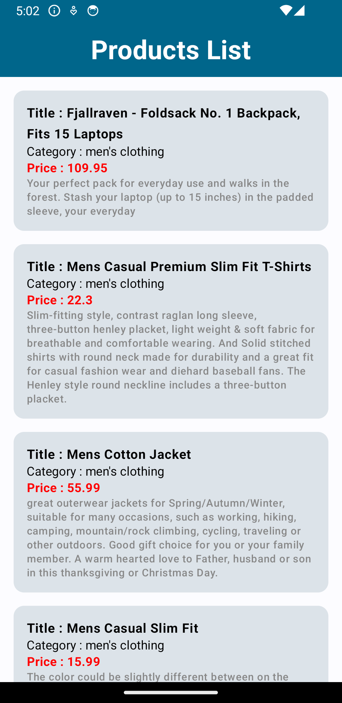

# Android_PLP_App

## Description

Android_PLP_App is an Android application built with **Kotlin**, **Jetpack Compose**, **Compose Navigation**, **Coroutines**, **Hilt Dependency Injection**, **Dagger 2**, **MVVM architecture**, **Room Database**, **Retrofit**, **Clean Code Architecture**, **Navigation**, and **Flow**. The app initially demonstrates best practices for developing Android apps with Jetpack Compose and a clean architecture approach using Dagger 2 for dependency injection. In further commits, the app is migrated to use Hilt Dependency Injection. It includes a Product Listing Page (PLP) for showcasing various products.

### Technologies Used:

- **Kotlin**
- **Jetpack Compose**
- **Compose Navigation**
- **Coroutines**
- **Hilt Dependency Injection**
- **Dagger 2**
- **MVVM**
- **Room Database**
- **Retrofit**
- **Clean Code Architecture**
- **Navigation**
- **Flow**

Android_PLP_App showcases best practices in Android development by leveraging these technologies.

## Screenshots

## Table of Contents

- [Installation](#installation)
- [Usage](#usage)
- [Contributing](#contributing)
- [License](#license)

## Installation

1. Clone the repository:
git clone https://github.com/rahulgothwal5/Android_PLP_App.git
2. Open the project in Android Studio.

## Usage

Explore the codebase to learn how to develop an Android application using **Jetpack Compose**, **MVVM architecture**, **Clean Code Architecture**, and **Dagger 2** for dependency injection. The app initially demonstrates the usage of Dagger 2 for dependency injection. In later commits, it is migrated to use Hilt Dependency Injection. It includes a Product Listing Page (PLP) for showcasing various products.

## Contributing

1. Fork the repository.
2. Create a new branch (`git checkout -b feature/your-feature-name`).
3. Make your changes.
4. Commit your changes (`git commit -am 'Add new feature'`).
5. Push to the branch (`git push origin feature/your-feature-name`).
6. Create a new Pull Request.

## License

This project is licensed under the [MIT License](LICENSE).
